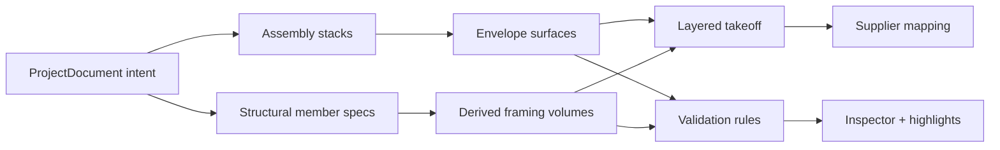
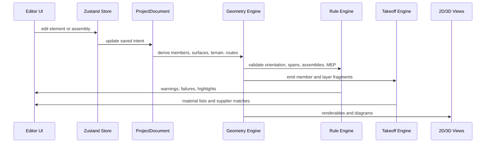

# Contractor Hub Architecture Plan

This is the living architecture document for Contractor Hub. It anchors the product around component-based construction modeling and should be treated as a development guide, not a legacy preservation plan.

## 1. Core Doctrine: Assembled Envelopes, Not Flat Planes

The app must not treat buildings as 2D outlines with decorative 3D boxes. It must model the physical assembly that a contractor would buy, cut, fasten, inspect, and estimate.



Key rule: every construction object must either be saved design intent or a reproducible derived physical component. A structural member may never exist only as a display line.

Current rebuild stance: when an old component or derivation path conflicts with this doctrine, replace it. Do not preserve training-wheel behavior just because it already exists.

## 2. Current Architecture

### Frontend

- React + Vite application.
- Three.js / React Three Fiber 3D viewport.
- Zustand state in `client/src/stores/bimProjectStore.ts`.
- BIM-lite schema and computational modules in `client/src/bim`.
- Professional editor modules in `client/src/editor`:
  - shell: mode rail, top bar, status bar, layout.
  - canvas: 2D plan, 3D viewport, diagram, selection handles.
  - tools: mode-specific tool panels and project browser.
  - inspector: placement, dimensions, assembly, derived, materials, code.

### Backend

- Express API in `server/src`.
- Current endpoints expose project, geometry derivation, validation, takeoff, supplier, and export boundaries.
- Persistence is still simplified; the server is not yet production storage.

### Source Of Truth

`ProjectDocument` is the saved source of truth. It stores user intent: site, terrain, levels, spaces, assemblies, materials, elements, supplier preferences, and jurisdiction profile. Derived data is regenerated from that document.

Current derived outputs include:

- terrain mesh and contours.
- framing members and 3D renderables.
- support grids, bearing points, join conditions, and unresolved intersection reports.
- roof planes and pier blocks.
- pier heights.
- rule results and clash candidates.
- takeoff rows.

## 3. BIM-Lite Model Direction

### Existing Concepts

The current schema already includes:

- `Assembly` and `AssemblyLayer`.
- `MaterialSpec` and `MaterialProfile`.
- `FramingMember`.
- `FramingRenderable`.
- `RoofPlaneDerived`.
- `TerrainContourDerived`.
- `TakeoffLine`.
- `RuleResult`.

These are the correct foundation. Step 6 formalized orientation, envelope surfaces, and layer takeoffs. Step 7B has now started the deeper framing kernel with support grids, bearing points, wall styles, roof attachment/purlin modes, and unresolved join reporting.

### Current Baseline After Step 7B

The current framing-kernel pass leaves the project in this state:

- The app is no longer organized around the earlier legacy layout.
- The active editor code lives under `client/src/editor`.
- The active BIM and derivation logic lives under `client/src/bim`.
- `AssemblyLayer`, `EnvelopeSurface`, and `LayerTakeoffFragment` exist and emit independent assembly-layer quantities.
- `MemberOrientation`, `StructuralMemberSpec`, cut length, stock length, and end-cut metadata exist on derived members.
- `SupportGrid`, `BearingPoint`, `MemberJoinCondition`, and unresolved intersection reporting exist as derived contracts.
- Floor/deck derivation now uses a support-grid pipeline rather than recalculating posts independently from beams.
- Wall and roof style fields are additive and backward-compatible, but the UI should prefer the new style controls.
- Rendering still uses simple boxes with cut markers. True cut solids and collision cleanup are the next major geometry task.

The saved source of truth remains `ProjectDocument`. Derived framing, renderables, support grids, warnings, and takeoff are regenerated.

### Model Concepts

#### AssemblyStack

An `AssemblyStack` is an ordered physical layer stack for walls, floors, and roofs.

Example wall stack:

```json
[
  { "side": "interior", "role": "finish", "materialId": "drywall-1-2", "thickness": 0.5 },
  { "side": "core", "role": "structure", "materialId": "stud-2x6", "spacing": 16 },
  { "side": "core", "role": "insulation", "materialId": "batt-r21" },
  { "side": "exterior", "role": "sheathing", "materialId": "osb-7-16", "thickness": 0.4375 },
  { "side": "exterior", "role": "weatherBarrier", "materialId": "house-wrap" },
  { "side": "exterior", "role": "siding", "materialId": "fiber-cement-siding" }
]
```

Required fields:

- layer side: interior, core, exterior, top, bottom, field, edge.
- layer role: finish, structure, insulation, sheathing, weatherBarrier, siding, roofing, subfloor, flooring, service.
- material ID.
- thickness or profile.
- coverage rule.
- waste factor source.
- takeoff behavior.

#### MemberOrientation

`MemberOrientation` defines how a physical member is installed relative to its load and local axes.

Planned values:

- `onEdge`: board depth is vertical or aligned to the strong axis.
- `flat`: board is laid on its weak axis.
- `vertical`: studs/posts upright.
- `slopedOnEdge`: rafters/struts installed on edge along a slope.
- `builtUp`: multiple plies act as one member.

Orientation must drive rendering, takeoff, and structural validation. A rafter, joist, beam, purlin, or strut cannot be silently rendered flat if it is expected to carry load on edge.

#### StructuralMemberSpec

A `StructuralMemberSpec` should describe:

- member type: stud, joist, rafter, purlin, beam, header, post, strut, blocking, plate, rim, ridge, tie.
- nominal size and actual material profile.
- species and grade when known.
- spacing and span.
- bearing/end conditions.
- orientation.
- source element and generated location.
- rule provenance.

#### EnvelopeSurface

An `EnvelopeSurface` is a generated surface quantity for a physical layer. It supports area takeoff and visual layer peeling.

Examples:

- drywall surface with openings deducted.
- house wrap surface with overlaps and waste.
- siding surface by wall face.
- roof underlayment and roofing by roof plane.
- flooring by room/floor polygon.
- insulation by wall cavity or floor/roof cavity.

#### LayerTakeoffFragment

A `LayerTakeoffFragment` is a normalized material quantity emitted from one assembly layer or framing member.

Required fields:

- source element ID.
- source layer/member ID.
- material ID.
- quantity and unit.
- phase.
- subsystem.
- room/wall/roof-plane/location.
- waste factor.
- supplier mapping key.

## 4. Logic Vacuum Guardrails

These rules prevent the app from drifting back into shape drawing:

- No structural member may be represented as a display-only line.
- Every derived member must know material, nominal size, actual dimensions, orientation, source element, and subsystem.
- Every assembly layer must be eligible to emit independent takeoff rows.
- Every exterior envelope must distinguish sheathing, weather barrier, and exterior finish.
- Every roof must distinguish structural framing, sheathing/decking, underlayment, and roofing.
- Every floor must distinguish framing, subfloor, insulation, and finish flooring.
- Every opening must reduce finish/siding/sheathing/wrap quantities where applicable.
- Structural orientation errors must be rule results, not hidden rendering quirks.

## 5. Validation Gates

### On-Edge Validation

Rafters, joists, beams, purlins, struts, headers, and other load-bearing members must have valid strong-axis orientation.

Examples:

- `rafter + flat` => fail or requiresEngineer.
- `joist + flat` => fail unless explicitly marked non-structural/blocking.
- `stud + vertical` => pass for standard wall framing.
- `purlin + flat` may be valid only when the purlin rules and roof material allow it.

### Assembly Completeness

Exterior walls should include:

- interior finish.
- core structure.
- insulation or intentional uninsulated flag.
- sheathing.
- weather barrier.
- exterior finish.

Roofs should include:

- structure.
- sheathing/decking or purlins as appropriate.
- underlayment or approved equivalent.
- roofing material.

Floors should include:

- structure.
- blocking/rim where required.
- subfloor.
- insulation where required.
- finish flooring when the design stage includes finishes.

### Framing Spacing

Spacing rules must be explicit and material-aware:

- Studs: normally 16 in or 24 in on center based on wall type and loads.
- Joists: spacing and span must be checked against table data.
- Rafters: spacing and span must be checked against table data.
- Blocking: required by span, depth, and assembly rules.
- Purlins: required or optional depending on roof system, span, and roofing material.

### Layered Takeoff

Every selected wall/floor/roof assembly must generate:

- per-layer material rows.
- global totals.
- location totals.
- subsystem totals.
- phase totals.
- supplier mapping candidates.

## 6. Data Flow



## 7. Current Framing Kernel

The framing kernel should evolve into this pipeline:

```text
Element intent
  -> normalized framing style
  -> support grid / bearing graph
  -> raw member layout
  -> join and trim resolver
  -> render solids
  -> rules / takeoff / exports
```

Implemented portions:

- Floor/deck support grids with edge/interior beams, ledger conditions, post bearing points, and pier block generation from support points.
- Wall style fields for exterior/interior/half/pony walls, corner style, intersection style, plate policy, and half-wall caps.
- Roof style fields for attachment, ridge policy, purlin mode, eave overhang, rake overhang, and roofing material.
- Structural purlin mode distinguishes braced purlins from battens/nailers.
- Inspector exposes key floor/deck/wall/roof framing style controls.
- Tests cover support grids, ledger decks, purlin struts, plates/corner packs, terrain seating, and unresolved intersections.

Still needed:

- True joined/trimmed member solids with angle cuts, collision cleanup, bearing seats, and no visual pass-through.
- Full wall intersection solver for corners, tees, offset intersections, braced panels, and sheathed exterior corners.
- Roof styles beyond gable/shed starter behavior: hip, valley, porch/lean-to, dormers, trusses, collar ties, and low-slope assemblies.
- Deck/porch/stair/guard/landing primitives with DCA6-style layout and connector/footing warnings.
- Data-driven span packs, footing/ledger rules, and code-profile provenance.

## 8. Implementation Priorities

The next architecture step is **Step 7C: Trimmed Solids, Roof/Wall/Floor Style Depth, And Construction Accessories**.

It should continue remaking weak geometry paths around the framing kernel, not polishing old display behavior. The priority is to make the building model operational before spending effort on blueprint/PDF polish, supplier pricing, or advanced MEP.

## 9. Accuracy Position

Contractor Hub should be code-aware and construction-aware, but it must not imply final approval. Prescriptive checks can pass or fail in-app. Any condition outside the encoded rules must be marked `requiresEngineer` or `requiresAHJ`.

The architecture goal is to support real construction workflows while preserving traceability: every warning, material quantity, and rendered member should connect back to the source design intent and the rule or assembly that created it.
